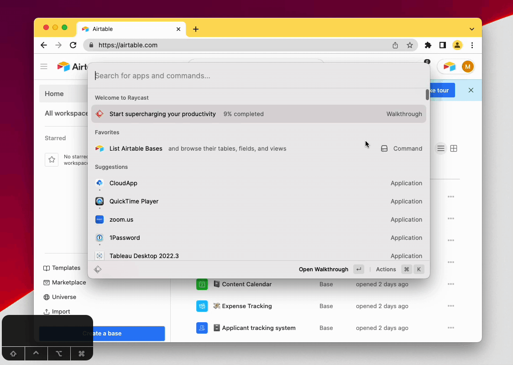

# Airtable Raycast Extension

[Raycast](https://raycast.com) is an extendable alternative to Apple's Spotlight. 

This extension uses Airtable's [OAuth support](https://airtable.com/developers/web/guides/oauth-integrations) ([beta as of November 2022](https://community.airtable.com/t/new-beta-new-api-authentication-methods-endpoints-and-public-api-docs/52714)) to allow a user to browse the bases, tables, fields, and views they granted the application access to (a part of the Airtable OAuth flow).

A GIF of the basic functionality is below. **[Follow this link to the Raycast extension store to install the extension.](https://www.raycast.com/marks/raycast-airtable-extension)**

---

The software made available from this folder is not supported by Formagrid Inc (Airtable) or part of the Airtable Service. It is made available on an "as is" basis and provided without express or implied warranties of any kind.

---
